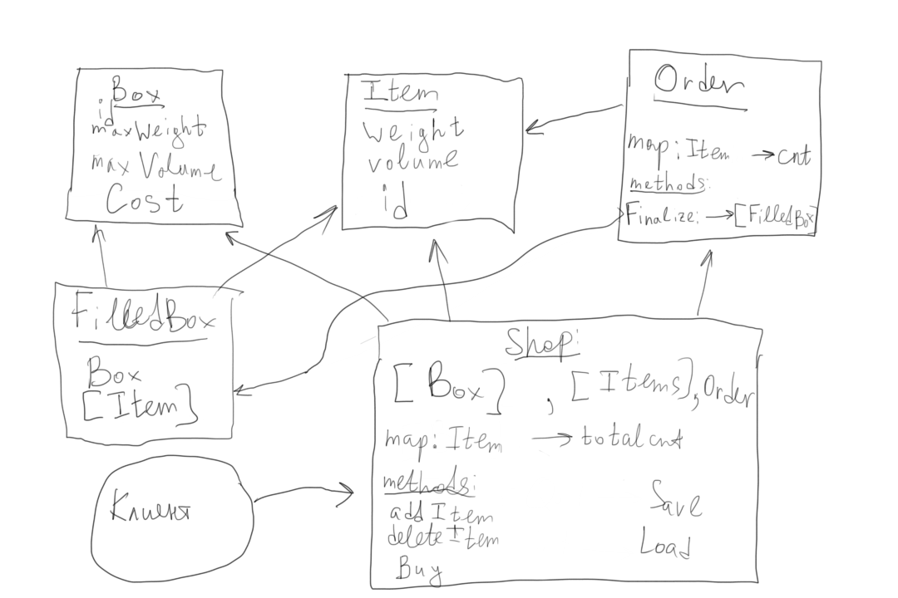

# Дорожная карта:

1 неделя: составление дорожной карты, изучение и подбор технологий, создание репозитория, формализация задачи

2 неделя: Настройка всех необходимых библиотек и создание каркаса программы из заглушек

3-4 неделя: Реализация алгоритма + юнит тесты + генерация примеров данных

5 неделя: Реализация консольного интерфейса

6-7 неделя: Реализация графического интерфейса

8 неделя: Сглаживание углов, доработка, тестирование

9-10 неделя: подготовка презентации + буфер времени

# Формализация задачи:

На складе есть набор товаров, каждый товар доступен в каком-то количестве. У каждого товара есть свой вес и объем.

Также на складе есть набор кородок. У каждой коробки есть свой объем, цена перевозки и максимальный вес, который в нее можно положить.

Пользователь выбирает, какие товары в каких количествах он хочет заказать, а программа выдает ему такое разделение этих товаров по коробкам, чтобы цена доставки была минимальной, учитывая следующие ограничения:

1. Нельзя в коробку положить товары, если их суммарный вес больше лимита веса для этой коробки.

2. Нельзя в коробку положить товары, если их суммарный объем больше объема коробки.

# Алгоритм:

Решаем задачу динамикой по маскам. Пусть у нас есть k видов коробок и n товаров в корзине.

minCost[mask] -- минимальная стоимость доставить товары из данной маски.

Тогда ответом будет являться minCost[2^n - 1].

Чтобы посчитать minCost[mask], мы перебираем, какие товары мы добавим в последнюю коробку (перебираем подмаску submask), после чего перебираем, в какую коробку эти товары могут поместиться и обновляем ответ через minCost[mask ^ submask], в котором хранится минимальная стоимость перевозки всех товаров кроме выбранных в текущую коробку.

В задаче нам не только надо найти минимальную стоимость, но и восстановить распределение товаров по коробкам. Для этого мы будем хранить массив предков: для каждой маски будет храниться оптимальная предыдущая маска, из которой мы обновили ответ.

Для того, чтобы можно было быстро посчитать суммарный объем и вес товаров в submask, сохраним еще одну динамику parametrs[mask], которая будет хранить суммарный вес и объем предметов из данной маски

Асимптотика решения по времени: O(3^n * k).

3^n -- перебор всех масок и подмасок, k -- перебрать коробку для предметов из submask. Обновление ответа происходит за O(1).

Асимптотика по памяти: O(2^n).

Хранятся несколько массивов размера 2^n.

# Преимущества и недостатки решения, алтернативы:

Преимуществом данного решения является то, что веса, объемы и деньги, то есть те величины, которые могут быть сколь угодно большими, не входят в асимптотику решения.

Минусом же данного решения является то, что асимптотика будет очень быстро расти относительно количества товаров в корзине. Если товаров больше 64, мы уже не можем хранить маски в стандартных целочисленных типах, но даже при количестве товаров > 30 решение будет работать существенное количество времени и занимать огромные объемы памяти.

## Альтернативами являются:

1. Жадное решение задачи. Оно не оптимально, поэтому не рассматривается.

2. Решения, использующие веса, объемы и деньги в асимптотике не рассматриваются также, потому что даже на самых маленьких корзинах приводят к огромным временным затратам.

## Пути решения этой проблемы на будущее:

1. Запретить делать заказ из более 20 товаров.

2. Разделять большую корзину в алгоритме на несколько корзин поменьше и решать задачу для них независимо. Возможно, стоит это сделать несколько раз случайным образом и выбрать лучший из вариантов. Однако в этом случае получится субоптимальное решение. Возможно, оно не лучше жадного.

# Схема программы:

class Box:

    boxId
    maxWeight
    maxVolume
    cost

class Item:

    itemId
    weight
    volume

class FilledBox:

    Box
    [Item]

class Shop:

    [Box]
    [Item]
    Order
    map: Item -> totalCnt
    map: Item -> curCnt
    
    Init(items, boxes)
    addItem(itemId)
    deleteItem(itemId)
    Buy() -> [FilledBox]
    Save()
    Load()

