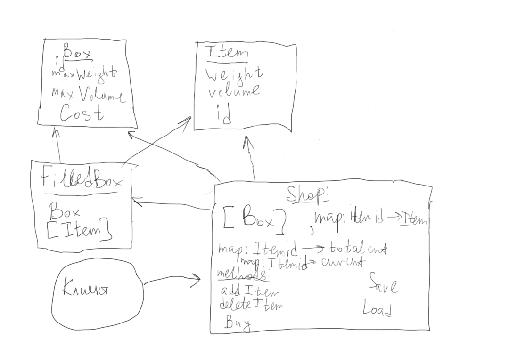

# Запуск

Сервер:
`g++ -std=c++17 -shared -o server.so -fPIC server.cpp -lsqlite3 && python3 server.py`

Графический интерфейс:
`g++ -std=c++17 -c graph.cpp && g++ -std=c++17 graph.o -o graph -lsfml-graphics -lsfml-window -lsfml-system && ./graph`
(для использования графического интерфейса необходимо дополнительно установить себе библиотеку SFML)

Юнит тесты магазина:
`g++ -std=c++17 tests_shop.cpp -o tests_shop -DTEST -lsqlite3 && ./tests_shop`

Юнит тесты для работы с базами данных:
`sqlite3 test_db.sqlite < setup.sql && g++ -std=c++17 tests_database.cpp -DTEST -o tests_database -lsqlite3 && ./tests_database`

Изначальная настройка магазина (для удобства тестирования и добавления товаров на стороне сервера):
`g++ -std=c++17 setup.cpp -o setup -lsqlite3 && ./setup`

# Формализация задачи:

На складе есть набор товаров, каждый товар доступен в каком-то количестве. У каждого товара есть свой вес и объем.

Также на складе есть набор кородок. У каждой коробки есть свой объем, цена перевозки и максимальный вес, который в нее можно положить.

Пользователь выбирает, какие товары в каких количествах он хочет заказать, а программа выдает ему такое разделение этих товаров по коробкам, чтобы цена доставки была минимальной, учитывая следующие ограничения:

1. Нельзя в коробку положить товары, если их суммарный вес больше лимита веса для этой коробки.

2. Нельзя в коробку положить товары, если их суммарный объем больше объема коробки.

# Алгоритм:

Решаем задачу динамикой по маскам. Пусть у нас есть k видов коробок и n товаров в корзине.

minCost[mask] -- минимальная стоимость доставить товары из данной маски.

Тогда ответом будет являться minCost[2^n - 1].

Чтобы посчитать minCost[mask], мы перебираем, какие товары мы добавим в последнюю коробку (перебираем подмаску submask), после чего перебираем, в какую коробку эти товары могут поместиться и обновляем ответ через minCost[mask ^ submask], в котором хранится минимальная стоимость перевозки всех товаров кроме выбранных в текущую коробку.

В задаче нам не только надо найти минимальную стоимость, но и восстановить распределение товаров по коробкам. Для этого мы будем хранить массив предков: для каждой маски будет храниться оптимальная предыдущая маска, из которой мы обновили ответ.

Для того, чтобы можно было быстро посчитать суммарный объем и вес товаров в submask, сохраним еще одну динамику parametrs[mask], которая будет хранить суммарный вес и объем предметов из данной маски

Асимптотика решения по времени: O(3^n * k).

3^n -- перебор всех масок и подмасок, k -- перебрать коробку для предметов из submask. Обновление ответа происходит за O(1).

Асимптотика по памяти: O(2^n).

Хранятся несколько массивов размера 2^n.

Если товаров в корзине много, то 3^n -- это плохая асимптотика, поэтому мы делаем следующее: несколько раз случайным образом делим заказ на маленькие подзаказы, а каждый маленький подзаказ упаковываем уже за O(3^n * k), после чего среди всех вариантов выбираем наилучший.

# Преимущества и недостатки решения, алтернативы:

Преимуществом данного решения является то, что веса, объемы и деньги, то есть те величины, которые могут быть сколь угодно большими, не входят в асимптотику решения.

## Альтернативами являются:

1. Жадное решение задачи. Оно не оптимально, поэтому не рассматривается.

2. Решения, использующие веса, объемы и деньги в асимптотике не рассматриваются также, потому что даже на самых маленьких корзинах приводят к огромным временным затратам.

# Схема программы:

